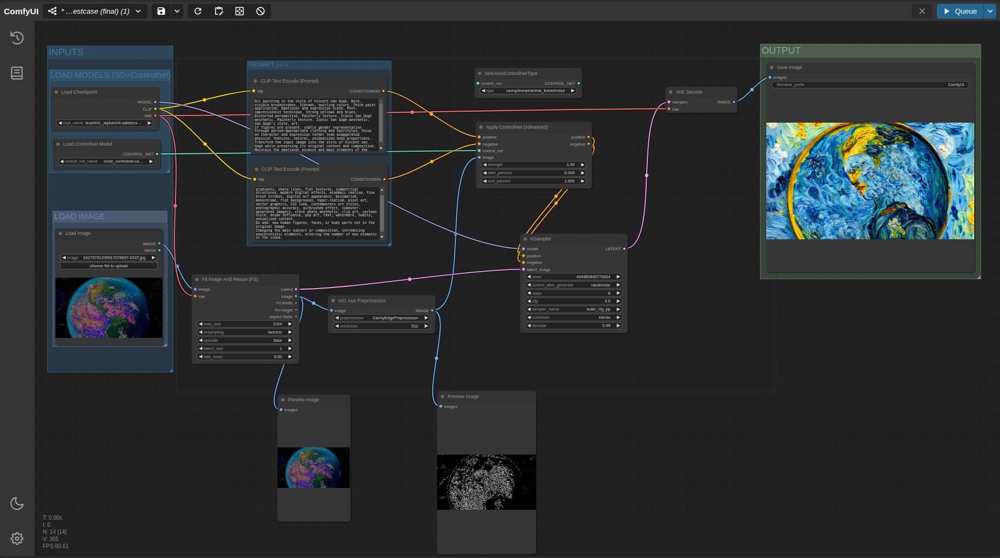

# **ComfyUI Workflow for Van Gogh Style Image Generation**  

This project contains a workflow for generating Van Gogh-style images using **Stable Diffusion** and **ControlNet** in **ComfyUI**. The workflow processes an input image and outputs a Van Gogh-style version of it.

## **Table of Contents**
1. [Requirements](#requirements)
2. [Installation](#installation)
3. [Usage](#usage)
4. [Examples](#examples)

---

## **1. Requirements**
Before starting, let's review the base components:
- [Python](https://www.python.org/downloads/)
- [ComfyUI](https://github.com/comfyanonymous/ComfyUI?tab=readme-ov-file#installing)
- [Stable Diffusion](https://civitai.com/models/325443/level4-xl)
- [ControlNet](https://huggingface.co/xinsir/controlnet-canny-sdxl-1.0)
- [PyTorch](https://pytorch.org/get-started/locally/)

You can learn about it by clicking the components given above. The harmony of these components is very important. Note that you work with appropriate versions of these reasons.
### Cloud Compute Instance Features*

| Feature     | Specification               |
|-------------|-----------------------------|
| RAM         | ~29GB                       |
| GPU         | Tesla P100 ~16GB             |
| CPU         | Intel Xeon CPU @ 2.20GHz     |

*Kaggle computing resources were used. You can access [Kaggle jupyter notebook from this link!](https://drive.google.com/file/d/1TpVvzAdqvwQQUYUu9nJZDFbhLqfU5lWU/view?usp=sharing)

### Component Versions

| Component  | Version                     |
|------------|-----------------------------|
| Python     | 3.10.14                     |
| PyTorch    | 2.4.0+cu118 with CUDA 1108  |
| xformers   | 0.0.27.post2+cu118          |
| ComfyUI    | v0.2.2                      |


**WARNING**: Compatibility between versions is critical and has been tested for the critical components shared above.


---

## **2. Installation**

The following critical steps were taken in order to work in the shared Jupyter Notebook.  
1. Clone ComfyUI  
```bash
git clone https://github.com/comfyanonymous/ComfyUI
```

2. Set Workspace  
```bash
cd $WORKSPACE
```

3. Add new nodes: "**comfyui_controlnet_aux**" and "**comfyui-fitsize**"  
Here, custom nodes are cloned and added to the custom node folder in ComfyUI.
```bash
!git clone https://github.com/Fannovel16/comfyui_controlnet_aux/ ./custom_nodes/comfyui_controlnet_aux
!pip install -r ./custom_nodes/comfyui_controlnet_aux/requirements.txt -q

!git clone https://github.com/bronkula/comfyui-fitsize.git ./custom_nodes/comfyui-fitsize            
```
- Check it out for detailed information about the added nodes:  [comfyui_controlnet_aux](https://github.com/Fannovel16/comfyui_controlnet_aux/) and [comfyui-fitsize](https://github.com/bronkula/comfyui-fitsize)  

4. Install general dependencies  (!)  
There is a critical installation at this stage. The specified version of xformers must be installed and ComfUI requirements are being installed. 
```bash
!pip install xformers==0.0.27.post2 --index-url https://download.pytorch.org/whl/cu118 -q
!pip install -r requirements.txt -q
```

5. Add model files  
Model files are copied to the required ComfUI folders.  
[Model Files](https://www.kaggle.com/datasets/shemskurtoglu/experiment-sd-comfyui/)

```bash
!cp /kaggle/input/experiment-sd-comfyui/level4XL_alphaV04.safetensors /kaggle/working/ComfyUI/models/checkpoints
!cp /kaggle/input/experiment-sd-comfyui/xinsir_controlnet-canny-sdxl-1.0.safetensors /kaggle/working/ComfyUI/models/controlnet

```
More details and implementations are available in the Jupyter Notebook.
For use in other environments, this will work if applied in this order, but has not been tested.  

Up to this point, all necessary files are loaded and ready.  

**Last step:**  
Since we are using an instance on the cloud, we interact with the Comfy interface using the **localtunnel** library. Localtunnel allows us to access the ComfyUI interface remotely. The necessary settings are available in Jupyter Notebook.  

If it will be used locally, the last step is not necessary.

## **3. Usage**

**For local use**, make sure you are in the ComfyUI directory:
```bash
python main.py 
```
This will start ComfyUI and you can use it by entering the address printed on the command line into your browser.

**For Jupyter Notebook**(kaggle), We have done the necessary operations with localtunnel for Jupyter Notebook. Similarly, there is an address in the output printed in the relevant cell and the password/endpoint value is on this address.  
Example:
```
The password/enpoint ip for localtunnel is: 34.127.74.65
your url is: https://cyan-planets-grow.loca.lt
```
We open the page from the browser with the sample address given above and enter the password.  

### ComfyUI Ready!!!  
Now we can use it. 

---
# Load Workflow

Load the workflow file with the "Load" button on the main menu, which is usually on the right, and all settings and configurations will be ready.  
**WORKFLOW FILE NAME:** *appnation_testcase_workflow.json*
  

---
# **Working Principle**  
Let's look at the components in more detail:  

**Level4 - SDXL Turbo** model is the basic model sdxl turbo and was preferred due to the innovation and speed offered by the basic model. It is an efficient model as it is better and faster than the previous model (SDXL 1.0). Its most important innovation is that it can produce high quality images in a single step using a new distillation technology called Adversarial Diffusion Distillation. 
Also, this SDXL Turbo model, obtained from the base model, also provides efficiency by being FP16.

**Controlnet** plays a crucial role in enhancing image diffusion models by incorporating conditional inputs, which refine the image synthesis process. Instead of relying on randomness, ControlNet ensures that the output is more deterministic and aligned with the input conditions. Given the objective of generating Van Gogh-style images, the ControlNet Canny version was deemed most appropriate. Specifically, the recently released Xinsir-ControlNet-Canny-SDXL-1.0 was selected due to its compatibility with SDXL Turbo and its proven effectiveness in producing high-quality, style-driven images.

It was necessary to add custom node and I didn't have to write code again for the test case. To adapt the workflow to the specific requirements of the task, custom nodes were incorporated. These nodes eliminated the need for additional coding while enhancing the workflow's adaptability and precision. The key custom nodes used include: 
* **comfyui-fitsize**: This node ensures that the input image is resized to a maximum resolution of 1024px without distorting its aspect ratio or degrading its quality. This step is crucial for maintaining the structural integrity of the image, making it more suitable for further processing.
* **comfyui_controlnet_aux**: This node facilitates the preprocessing required for ControlNet. It specifically performs the canny edge detection process, which is essential for guiding the image synthesis toward Van Gogh’s unique artistic style.

With the harmonious operation of all components, Workflow was brought together.

**Workflow Integration**  
The harmonious interaction of all these components forms the backbone of the workflow. Each component is optimized to work in tandem, ensuring both high efficiency and quality. The SDXL Turbo model provides the speed and distillation technology, while ControlNet refines the process with conditional inputs. The custom nodes enhance flexibility and precision, ensuring that the images generated are both accurate and stylistically consistent.

Performance and Efficiency
During testing, the system utilized nearly 99% of the available processing capacity, indicating full usage of both GPU and CPU resources. In terms of memory consumption:

* Approximately 14 GB of RAM was used.
* Around 9.1 GB of GPU memory was consumed, showcasing the intensive nature of the image generation process.  

This high resource utilization demonstrates the system's efficiency in handling complex tasks like Van Gogh-style image generation, balancing both speed and quality.


---
## Download files  
1.[Kaggle jupyter notebook](https://drive.google.com/file/d/1TpVvzAdqvwQQUYUu9nJZDFbhLqfU5lWU/view?usp=sharing)    
2. [Only Model Files](https://www.kaggle.com/datasets/shemskurtoglu/experiment-sd-comfyui/)  
3. [Workflow file](https://drive.google.com/file/d/1LpzXbTEO0US0p8xO73J_TrLuJeQtSLft/view?usp=sharing)

Also custom nodes:  
* [comfyui_controlnet_aux](https://github.com/Fannovel16/comfyui_controlnet_aux/)  
* [comfyui-fitsize](https://github.com/bronkula/comfyui-fitsize)  

  
---
## **4. Examples**


| Original Image     | Transformed Image (Van Gogh Style) |
|--------------------|------------------------------------|
|  |  |
| **Image 1**        | **Image 1 - Van Gogh Style**       |
|  |  |
| **Image 2**        | **Image 2 - Van Gogh Style**       |
|  |  |
| **Image 3**        | **Image 3 - Van Gogh Style**       |
